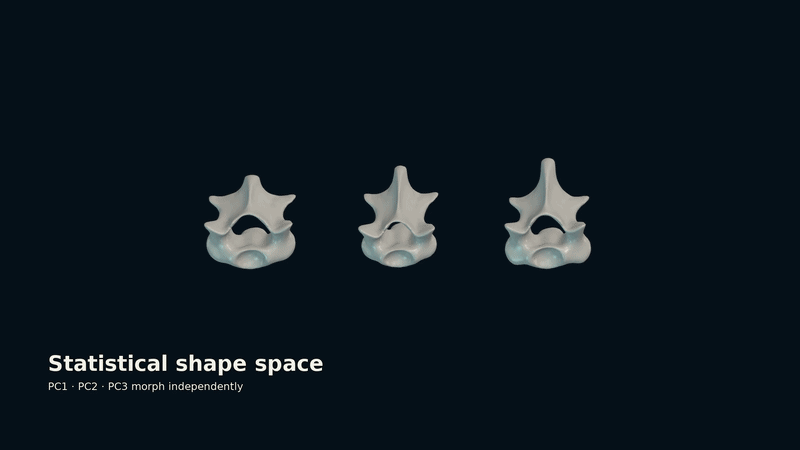
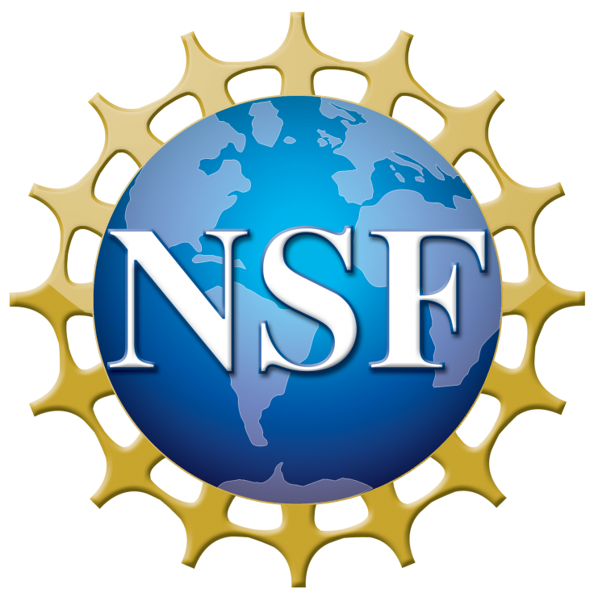

<p align="center">
  
</p>

<p align="center"><strong>Weaving biological form into a common geometric language</strong></p>

<p align="center">
  
</p>

<p align="center">
  A 3D Slicer extension for anatomical atlas construction, statistical shape modeling, biology-guided deformable registration, and automated landmark transfer.
</p>

<p align="center">
  <a href="tutorial/README.md"><strong>Tutorial</strong></a> ·
  <a href="https://github.com/agporto/SlicerMorphoWeave/issues"><strong>Issues</strong></a> ·
  <a href="https://discourse.slicer.org/"><strong>Slicer Forum</strong></a>
</p>

## Overview

MorphoWeave provides an integrated workflow for generating and applying 3D anatomical atlases. It supports:

- construction of mean atlas surfaces and dense correspondences from meshes and sparse landmarks;
- creation and interactive exploration of PCA-based statistical shape models;
- single-specimen and batch landmark transfer using rigid and shape-model-guided deformable registration;
- target-specific template optimization before registration; and
- correspondence-guided segmentation of surface models.

MorphoWeave runs within [3D Slicer](https://www.slicer.org/). [SlicerMorph](https://slicermorph.github.io/) is recommended for complementary morphometric workflows but is not required.

## Installation

### 3D Slicer Extension Manager

Once listed in the official Slicer Extensions Catalog:

1. Open 3D Slicer.
2. Select **View > Extension Manager**.
3. Search for **MorphoWeave** and click **Install**.
4. Restart Slicer when prompted.
5. Find the modules under the **MorphoWeave** category.

### Developer installation

```bash
git clone https://github.com/agporto/SlicerMorphoWeave.git
```

In Slicer, open **Developer Tools > Extension Wizard**, choose **Select Extension**, and select the cloned repository folder.

## Workflow

1. **Atlas Builder** aligns training meshes and landmarks and creates an atlas surface with sparse and dense correspondences.
2. **Model Library** converts population correspondences into a PCA statistical shape model and loads it for exploration and registration.
3. **Landmark Transfer** transfers landmarks to individual specimens or batches using rigid registration, SSM-guided CPD, optional fine deformation, and surface projection.
4. **Surface Segmentation** uses dense correspondences to divide homologous surface regions consistently across specimens.

A complete illustrated walkthrough is available in the [MorphoWeave tutorial](tutorial/README.md).

## Modules

### Atlas Builder

Constructs an anatomical atlas from folders of surface models and corresponding sparse landmarks. Atlas Builder selects a representative reference, aligns the specimens, generates a mean surface, and derives index-consistent dense correspondences.

Enable **Save SSM to Model Library** to ingest successful atlas outputs directly into the configured library. Enter a safe model name; Atlas Builder displays the destination from `MorphoWeaveModelLibrary/databasePath` (by default `Documents/MorphoWeaveModels`) and asks before writing to an existing entry. Auto-save runs only after dense correspondence export succeeds.

**Keep aligned models and landmarks** is enabled by default. Disable it when only the atlas and population correspondences are needed; MorphoWeave still creates the aligned derivatives in a temporary workspace for processing and removes them afterward. Original input meshes and landmarks are never copied or modified.

Atlas Builder was originally adapted from the Dense Correspondence Landmarking (DeCAL) workflow in [SlicerDenseCorrespondenceAnalysis](https://github.com/SlicerMorph/SlicerDenseCorrespondenceAnalysis), developed by the SlicerMorph project. It substantially restructures and extends that workflow for MorphoWeave, including more robust model-landmark pairing, coordinate-system validation, mesh-quality safeguards, revised atlas construction, optional biharmonic deformation with TPS fallback, index-stable dense correspondence export, and direct integration with the Model Library and Landmark Transfer modules. See [Atlas Builder attribution and lineage](MorphoWeaveAtlasBuilder/README.md) and [third-party notices](THIRD_PARTY_NOTICES.md).

**Primary outputs**

- aligned models and landmarks, when retained;
- `atlas_model.ply`;
- `atlas_sparse_landmarks.mrk.json`;
- `atlas_dense_correspondences.mrk.json`; and
- specimen-level population correspondences.

### Model Library

Builds and stores a PCA statistical shape model from dense population correspondences. Model Library validates point consistency, computes the retained shape basis, saves the model, and provides interactive principal-component visualization through **SSM Explorer** in Slicer.

**Primary outputs**

- `manifest.json`;
- `ssm_model.npz`; and
- the associated template model and markup files.

### Landmark Transfer

Transfers template landmarks to target surface models in single or batch mode. The registration pipeline combines point-cloud subsampling, FPFH features, RANSAC and ICP rigid alignment, PCA-guided Coherent Point Drift, optional fine deformation, and optional surface projection.

Landmark Transfer also provides two target-specific template-optimization backends:

- **FPFH + RANSAC**, the default feature-based SSM search; and
- **Pose-marginalized EM**, an experimental initializer that evaluates global pose hypotheses while jointly refining SSM shape and similarity pose.

When a canonical Model Library quartet is loaded (`ssm_data_<name>`, `<name>_template`, `<name>_template_correspondences`, and `<name>_template_sparse_landmarks`), Landmark Transfer fills only empty template and SSM selectors with the most recently loaded complete, point-count-compatible set. Manual selections and target-model selectors are left unchanged. Optimization-backend settings, **Rigid registration**, and **Deformation backend** start collapsed and expand only when requested.

**Primary outputs**

- predicted landmark `.mrk.json` files;
- warped template models;
- projected landmark refinements; and
- optional batch mesh exports.

### Surface Segmentation

Segments homologous anatomical regions across meshes using dense correspondence trajectories and graph-based clustering. It exports labeled surface models and a label lookup table.

Across all modules, compact text states such as **Needs input**, **Ready**, **Optional**, and **Complete** accompany restrained color accents; the state remains available as text and accessibility metadata.

## Python dependencies

MorphoWeave uses Slicer-provided Python, VTK, NumPy, and SciPy. Landmark Transfer additionally requires:

- [`tiny3d`](https://pypi.org/project/tiny3d/) for point-cloud processing and rigid registration; and
- [`biocpd>=1.3`](https://pypi.org/project/biocpd/) for shape-model-guided deformable registration and pose initialization.

When these packages are missing or incompatible, Landmark Transfer asks for permission before installing or upgrading them through Slicer's Python environment. An internet connection is therefore required the first time those dependencies are installed.

The Pose-marginalized EM backend is optional. The established FPFH + RANSAC template optimizer remains the default.

## Related 3D Slicer extensions

- [SlicerMorph](https://slicermorph.org/) provides the broader digital-morphology ecosystem, including landmark editing, geometric morphometrics, and ALPACA/MALPACA point-cloud landmark-transfer workflows. MorphoWeave complements it with explicit atlas construction, persisted statistical shape models, shape-model-guided transfer, and correspondence-guided segmentation.
- [SlicerDeCA](https://github.com/SlicerMorph/SlicerDeCA) creates dense surface correspondences and supports dense shape analysis. MorphoWeave's Atlas Builder originated from its DeCAL workflow and now feeds an integrated atlas-to-SSM-to-transfer pipeline.
- Slicer's **Surface Toolbox** supports mesh repair, smoothing, decimation, and related preprocessing that may be useful before running MorphoWeave.

## Documentation and support

- [MorphoWeave tutorial](tutorial/README.md)
- [Issue tracker](https://github.com/agporto/SlicerMorphoWeave/issues)
- [3D Slicer documentation](https://slicer.readthedocs.io/)
- [SlicerMorph tutorials](https://github.com/SlicerMorph/Tutorials)
- [Slicer Forum](https://discourse.slicer.org/) — use the *Morphology* or *Extensions* categories

For errors, open **View > Error Log** in Slicer and include the relevant traceback and reproduction steps in the issue report.

### 3D Slicer smoke-test checklist

- [ ] Run Atlas Builder with Model Library save disabled, then enabled with a new valid name.
- [ ] Run Atlas Builder with aligned-output retention enabled and disabled; confirm input files remain untouched and disabled runs omit `alignedModels/` and `alignedLMs/`.
- [ ] Decline and accept the overwrite prompt for an existing library entry; verify dense-export failure never triggers ingest.
- [ ] Exercise **Needs input**, **Ready**, **Optional**, and **Complete** states across all four modules and confirm their accessible names include the state.
- [ ] Load multiple canonical SSM sets, re-enter Landmark Transfer, and verify the latest complete point-count-compatible quartet fills only empty selectors.
- [ ] Make manual template and SSM selections, re-enter the module, and verify they and all target-model selections remain unchanged.
- [ ] Switch optimization backends and verify both backend boxes, **Rigid registration**, and **Deformation backend** remain collapsed until clicked.

## Troubleshooting

| Issue | Likely cause | Suggested action |
|---|---|---|
| Landmark count mismatch in Atlas Builder | Input landmark files contain inconsistent numbers of points | Standardize landmark counts and regenerate the affected files |
| Subsampling produces no points | Point density is too low or model scales differ substantially | Increase **Point Density** or enable scaling |
| Poor RANSAC alignment | Feature radii or distance threshold are too restrictive | Increase the normal/FPFH radii or RANSAC distance threshold |
| PCA-CPD stops early | The loaded SSM does not match the template correspondence count | Rebuild or reload the matching database |
| Projection overshoots the surface | Projection distance is too large | Reduce the maximum projection factor |
| Batch cancellation is delayed | The current specimen is completing a long registration step | Allow the current step to finish or reduce RANSAC iterations |

## Funding

<p align="center">
  <a href="https://www.nsf.gov/awardsearch/showAward?AWD_ID=2422839">
    
  </a>
</p>

This material is based upon work supported by the U.S. National Science Foundation under Award No. [2422839](https://www.nsf.gov/awardsearch/showAward?AWD_ID=2422839).

This work was supported in part by the University of Florida Artificial Intelligence and Informatics Research Institute ([AIIRI](https://ai.research.ufl.edu/)).

Any opinions, findings, conclusions or recommendations expressed in this material are those of the authors and do not necessarily reflect the views of the U.S. National Science Foundation.

## Citation

Until the formal MorphoWeave publication is available, cite the software repository:

```text
Porto, A. MorphoWeave: Atlas-based 3D landmark transfer and statistical shape modeling.
https://github.com/agporto/SlicerMorphoWeave
```

When using Atlas Builder, also cite the relevant SlicerDenseCorrespondenceAnalysis/DeCA software and publication. Please additionally cite the methods and software used by the relevant workflow, including 3D Slicer, SlicerMorph when used, and the `biocpd` or `tiny3d` documentation as appropriate.

## License

MorphoWeave is distributed under the [BSD 2-Clause License](LICENSE). Portions of Atlas Builder were adapted from SlicerDenseCorrespondenceAnalysis under its BSD 2-Clause License; see [THIRD_PARTY_NOTICES.md](THIRD_PARTY_NOTICES.md).

## Maintainer

**Arthur Porto**
Florida Museum of Natural History, University of Florida
