

# ATLAS: Scaling 3D morphometrics across biodiversity with atlas-based automated landmarking

`ATLAS` is a companion extension to SlicerMorph, focused on high‑fidelity, scalable generation and transfer of 3D anatomical landmarks and dense correspondences using atlas construction, Statistical Shape Models (SSMs), and PCA‑guided deformable registration.

## Overview
`ATLAS` streamlines:
* Building an atlas (mean model + dense correspondences) from meshes and sparse landmarks
* Constructing and persisting PCA Statistical Shape Models for variation exploration
* Single and batch automated landmark transfer with robust rigid + PCA‑CPD deformable alignment and optional surface projection
* Continuous optimization of the template (pose + shape) before large batch runs
* Segmentation of the 3D model into parts

## Module Descriptions
Open ATLAS ⟶ BUILDER.
You should observe the following screen:

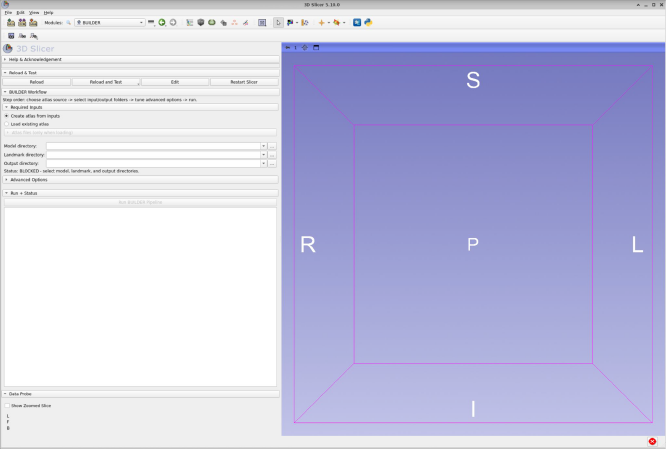

`ATLAS` organizes functionality into three scripted modules: `BUILDER`, `DATABASE`, and `PREDICT`.    

#### BUILDER   
**Category**: Atlas & Correspondence Generation   
**Purpose**: Align a set of meshes and sparse landmark sets; automatically pick a reference (closest to mean), similarity-align all specimens, generate a mean (atlas) surface, and derive dense correspondences via TPS warp + k‑d tree mapping. Optionally downsamples to produce a sparser, index‑stable subset.   
**Key Outputs**: Timestamped output folder containing aligned meshes (alignedModels/*), aligned landmarks (alignedLMs/*), atlas files (atlas/atlas_model.ply, atlas/atlas_sparse_landmarks.mrk.json), and sampled dense set (atlas/atlas_dense_correspondences.mrk.json) plus per-specimen dense correspondences in population_correspondences/.   
**Notable Features**: Robust base selection; flexible file stem resolution; index preservation during downsampling.   

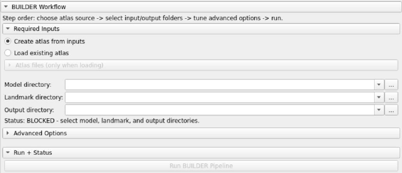

#### DATABASE   
**Category**: Statistical Shape Modeling   
**Purpose**: Build a PCA SSM from a folder of dense correspondences; store as a lightweight on‑disk database with manifest; load into scene for interactive mode exploration.   
**Workflow**: Ingest ⟶ validate consistent point counts ⟶ SVD (variance threshold) ⟶ save mean, modes, eigenvalues.   
**Visualization**: Single-PC slider + spinbox; deforms mesh in real time using k‑NN interpolation (weights from inverse distance) between landmark displacements and all vertices.   
**Outputs**: manifest.json, ssm_model.npz, copied template and markup files.   

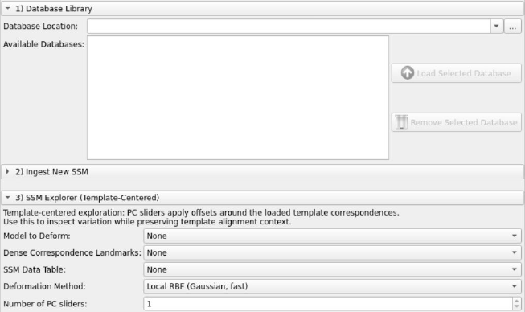

#### PREDICT   
**Category**: Automated Landmark Transfer   
**Purpose**: Transfer template sparse landmarks to a target mesh (single or batch) via multi-stage alignment: subsampling & FPFH features ⟶ RANSAC + ICP rigid alignment ⟶ PCA‑guided Coherent Point Drift (CPD) deformable registration ⟶ optional surface projection refinement. Batch mode can also optionally export the warped template mesh for each target.   
**Modes**:
  * Single specimen alignment (tune parameters, inspect intermediate clouds/models)
  * Batch processing (reuse tuned parameters; cancellation + progress)
  * Template optimization (continuous search in SSM space + RANSAC scoring to refine initial template pose/shape)   

**Outputs**: Predicted landmark .mrk.json files, warped template models (scene), optionally refined projected landmarks, and optional batch warped mesh exports as .vtp files.   

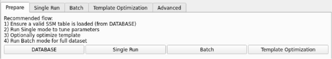

## BUILDER
Now that we are acquainted with the overall layout of ATLAS, let's start by building a mean (atlas) surface and landmarks (sparse and dense).

### Step 1. Download sample data
Download the ATLAS sample dataset from [here](https://github.com/SlicerMorph/Mouse_Models)*. Click `Code` at the upper right corner then `Download Zip`. Extract all the files to a local directory. Return to 3D Slicer, go to the `ATLAS` module, then to `BUILDER`. * *Note: Pending pull request to fix broken mesh, FVB_NJ.ply. Otherwise, download data and delete broken mesh manually or repair using Slicer Surface Toolkit.*

### Step 2. Populate `Required Inputs`
Set `Model directory` with source models (.ply format), `Landmark directory` with source landmarks (.mrk.json format), and `Output directory`. In `Output directory`, a timestamped folder will be made containing aligned meshes (alignedModels/*), aligned landmarks (alignedLMs/*), dense correspondences/semilandmarks (population_correspondences/*), and atlas files (atlas/atlas_model.ply, atlas/atlas_sparse_landmarks.mrk.json, atlas/atlas_dense_correspondences.mrk.json).

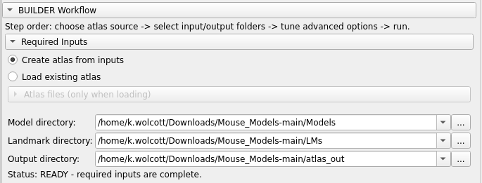

### Step 3. Specify `Advanced Options` for atlas and dense correspondences generation.   
* **Normalize scale**: Defaults to True. Normalizes the scale of specimens and landmarks.
* **Override landmark ⟷ mesh coordinate check**: Defaults to False. Checks that meshes and landmarks are in the same coordinate system (ex: RAS). 
* **Warp method**: Defaults to TPS (recommended). Warp using thin plate splines (TPS; more smooth and flexible) or biharmonic (more rigid). 
  * * **Auto-fallback to TPS if biharmonic fails**: Defaults to True.
* **Sampling radius (% of diag)**: Choose a value that will produce 2000 - 4000 expected dense correspondence points. 
* **Expected points**: Adjust `Sampling radius` and click `Preview Point Count` until desired count is achieved.

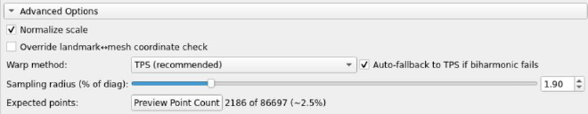

### Step 4. Under `Run + Status`, Click `Run BUILDER Pipeline`.
Progress will be reported in the window below `Run BUILDER Pipeline` and a model with landmarks should appear in the 3D viewer.

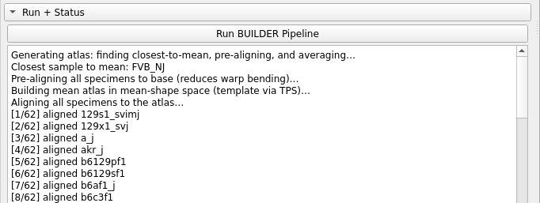

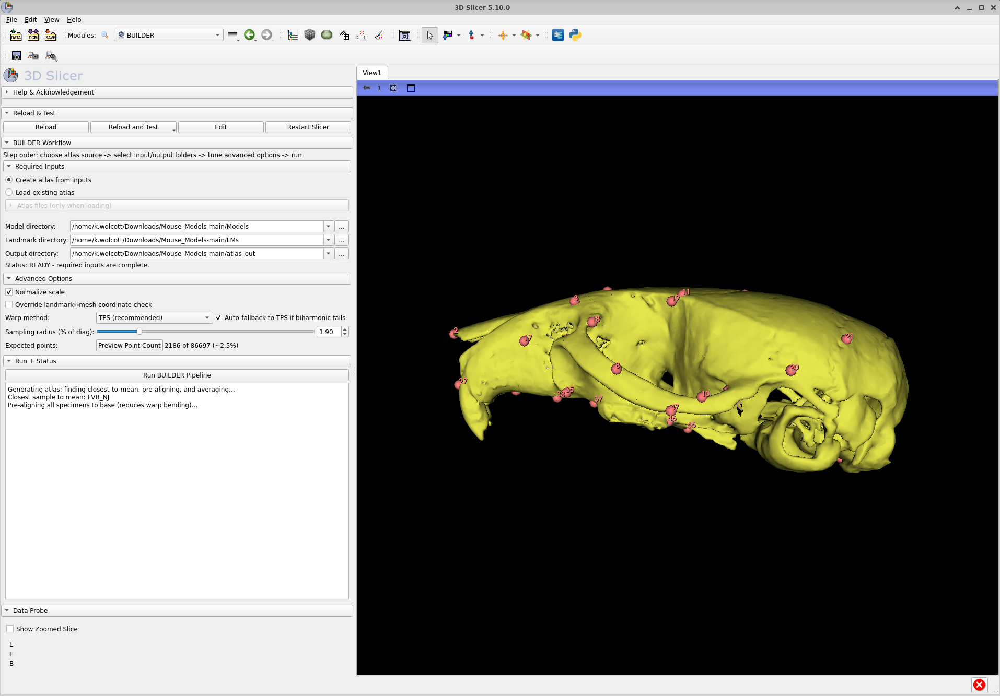

If everything worked, you will see something indicating saved outputs and their locations.

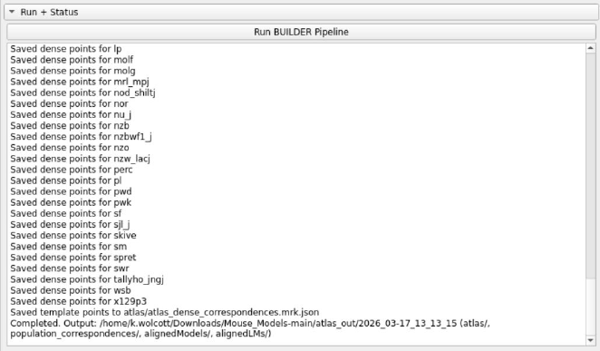

## DATABASE
Use atlas and dense correspondences from `BUILDER` to make a PCA-based statistical shape model (SSM) database. 

### Step 1. `Database Library`: Specify `Database location` output from `BUILDER`.
For example: atlas_out/YYYY_MM-DD_HH_MM_SS 

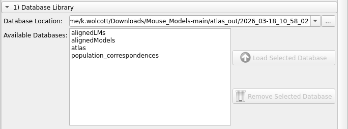

### Step 2. `Ingest New SSM`: Select corresponding files and folders found within `Database location` above.
* **Template Model**: atlas/atlas_model.ply
* **Dense Correspondences**: atlas/atlas_dense_correspondences.mrk.json 
* **Sparse Landmarks**: atlas/atlas_sparse_landmarks.mrk.json 
* **Population Correspondences Folder**: population_correspondences/* 
* **New Database Name**: your database name (ex: mouse_db)

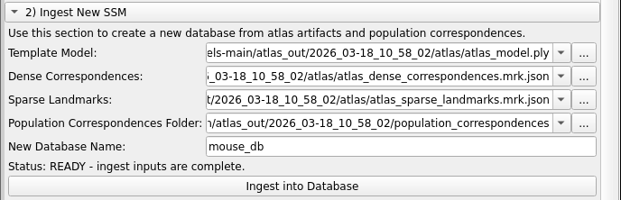

Click `Ingest into Database`

### Step 3. `Database library`: Load database into ATLAS.
Under `Database Library`, your new database should appear. Select your new database and click `Load Selected Database`.

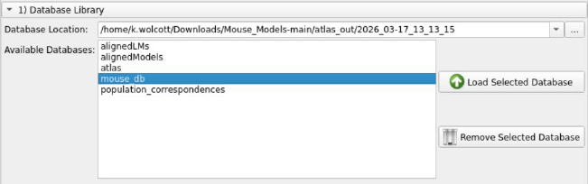

### Step 4. `SSM Explorer (Template-Centered)`: Explore SSM changes through principal component space. 
The form fields under `SSM Explorer (Template-Centered) will automatically populate and your atlas model and landmarks will open in the 3D viewer. 

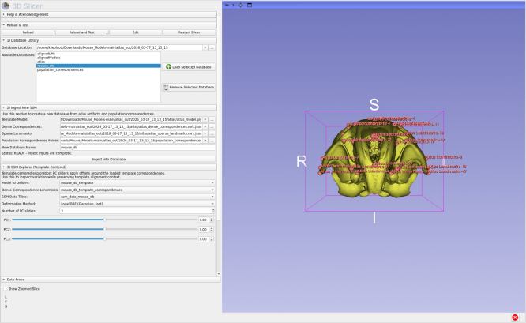

Adjust positions on PC sliders to visualize morphological change across &plusmn;SD's for each principal component.

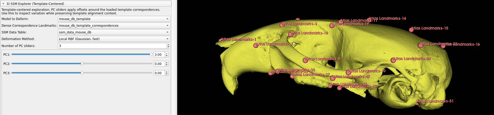

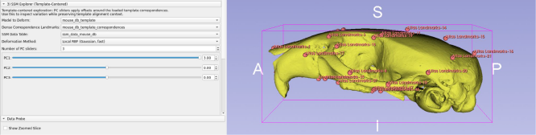

## PREDICT
Use the SSM database from `DATABASE` to predict landmark positions on new specimens. 

### Step 1. `Prepare`: Ensure SSM is loaded.
Follow [`DATABASE` ⟶ Step 3 above](https://github.com/aubricot/ATLAS-seg/tree/tutorial/tutorial#step-3-database-library-load-database-into-atlas).

### Step 2. `Single Run`: Run landmark prediction for a single target mesh.
* **Template Model**: <your_ssm>_template
* **Template Correspondences**: <your_ssm>_template_correspondences 
* **Template Landmarks**: <your_ssm>_template_sparse_landmarks
* **Target model**: Choose a model to predict landmarks for
* **SSM Data Table**: ssm_data_<your_ssm>

Load a model to predict landmarks for into your Scene using the 3D Slicer Add Data button. 

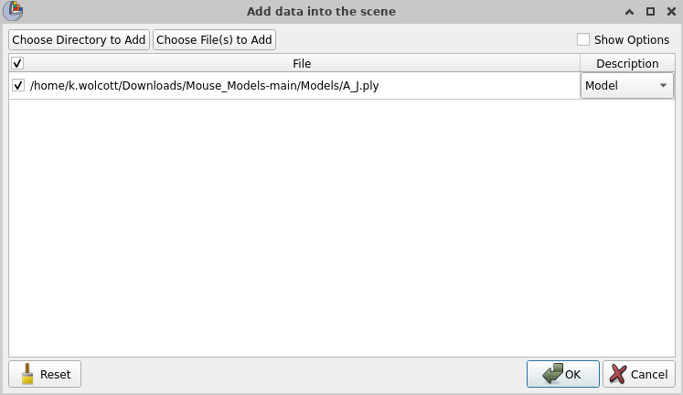

Ensure all form fields are correctly filled.
  

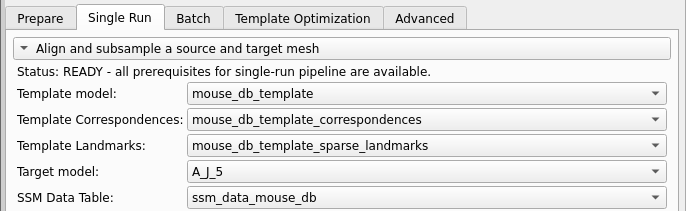

   
1) Subsample source/target.   
Downsample source and target point clouds based on value set in Advanced ⟶ Point density and max projection ⟶ Point Density.
   

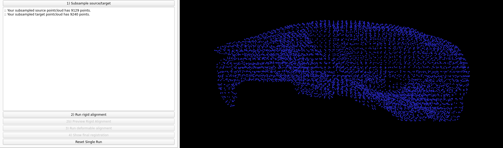

   
2) Run rigid alignment.   
Global (RANSAC) and rigid (ICP) registration that register the source point cloud to the target.
   

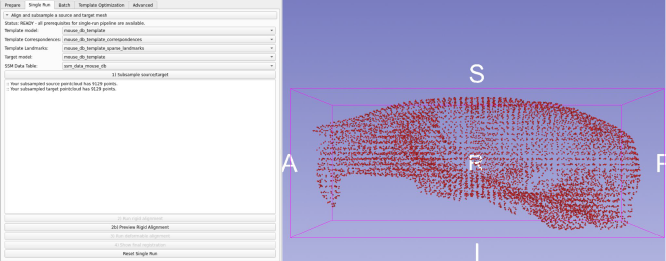

   
2) b. Preview Rigid Alignment.   
   

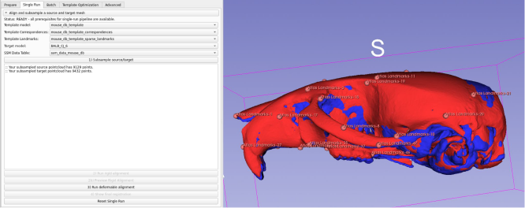

   
3) Run deformable alignment.   
Registration where source point cloud is deformed to target point cloud, then the registration is used to propagate the source landmarks to target specimen. Uses atlas/SSM as biological prior to avoid biologically implausible deformations (bioCPD) followed by CPD (coherent point drift) to capture local details. 

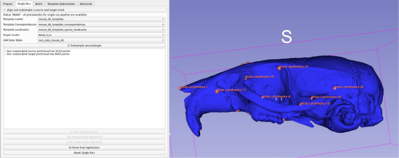

4) Show final registration.
   

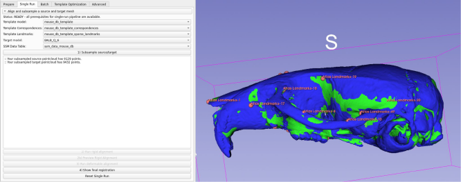

   
### Step 3. Display and evaluate ATLAS results.
All results are saved in the PREDICT runs folder that can be viewed in the 3D Slicer Data module. Rotate and inspect results (meshes, pointclouds, landmarks) to ensure the alignment and landmark prediction behaviors are as expected.

By default, only the Warped Source model (green), Target Model (blue), and the final ATLAS Refined Predicted Landmarks are displayed.

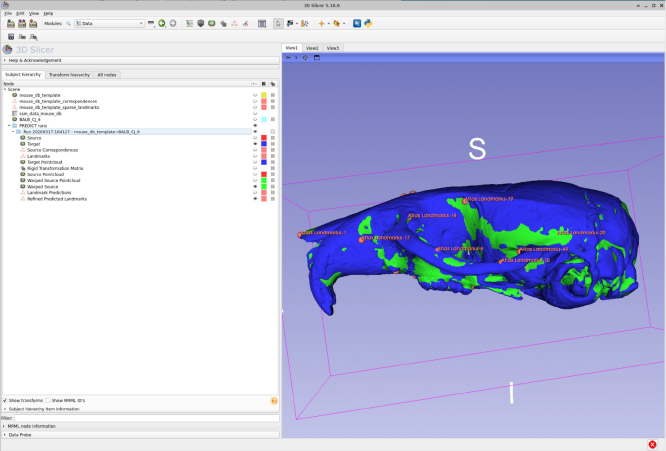

To display the Landmark Predictions (pink) versus the Refined Predicted Landmarks (pink), change the color of the Refined Predicted Landmarks to blue. Then, toggle the visibility (eyeball button) to on.

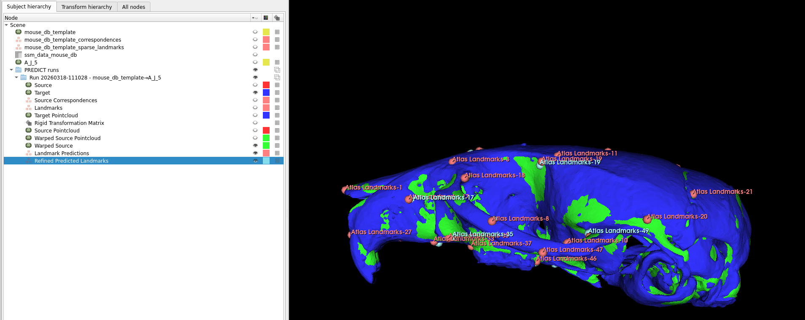

To display the rigidly registered Source Pointcloud (red) and Target Pointcloud (blue), toggle the visibility (eyeball button) to on and turn off any other visible nodes.

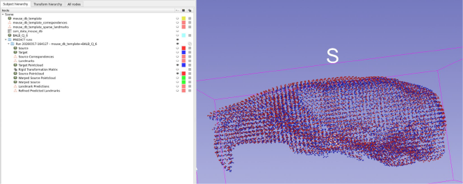

### Step 4. (Optional): Fine tune landmark prediction parameters and repeat Steps 2-3 until desired results are achieved. 
These steps are especially important for macroevolutionary comparative analyses that may deviate from the original SSM.

### Step 4a. (Optional): `Template Optimization`: Optimize template for Target model to improve landmark transfer prediction.
* **Template Model**: <your_ssm>_template
* **Template Correspondences**: <your_ssm>_template_correspondences 
* **Template Landmarks**: <your_ssm>_template_sparse_landmarks
* **Target model**: Choose a model to predict landmarks for
* **SSM Data Table**: ssm_data_<your_ssm>
* **Optimization backend**:
  * **FPFH + RANSAC (current)** preserves the established feature-based template search and remains the default.
  * **Pose-marginalized EM (experimental)** evaluates deterministic global rotations, jointly refines SSM coefficients and similarity pose, and completes SSM registration from that warm state.

The current backend will either produce an optimized template or retain the baseline when it is already a good fit. The experimental backend produces a target-pose template and reports score margin, effective pose count, and evaluated/refined hypothesis counts. When that result is sent to `Single Run`, PREDICT recognizes that global pose is already available and uses an identity rigid handoff rather than repeating RANSAC.

Pose-EM settings control the number of base rotations, coarse source/target samples, coarse SSM rank and iterations, the number of finalists, refinement target samples and iterations, the identity-pose prior, and the deterministic seed. The rotation lattice also includes near-identity shells, so the number of evaluated hypotheses is larger than the base-rotation value. For incomplete targets, PREDICT uses `Target completeness` to prescale the SSM and fixes scale during final atlas registration; inspect ambiguity diagnostics carefully because partial or symmetric anatomy may support several poses.

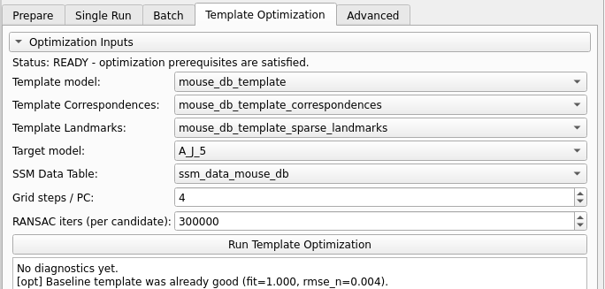

### Step 4b. (Optional): `Advanced`: Adjust advanced parameters. 
`General Settings`
* **Skip scaling**:  Disables size normalization between template and target
* **Skip projection**: Skips final surface snap of landmarks
* **Skip template optimization (batch)**: Uses same template for all targets (faster)
* **Target completeness (linear fraction)**: Fraction of specimen intact (0.5 = 50% complete)

`Point density and max projection`
* **Point Density**: Higher = more points, slower. Default 1.3
* **Max projection factor (%)**: Max distance landmarks move to surface (% of size)

`Rigid registration`
* **Normal search radius**: Radius for surface normal estimation. Higher = smoother
* **FPFH search radius**: Feature descriptor neighborhood size. Higher = more robust
* **RANSAC distance threshold**: Max distance for point match. Higher = more tolerant
* **Max RANSAC iterations**: Max attempts to find alignment. Default 400k
* **RANSAC confidence**: Probability of finding good match. Default 0.999
* **ICP distance threshold**: Refinement tolerance after RANSAC. Default 0.4

`Deformation backend`
* **Experimental: Use biharmonic surface warp**: Experimental alternative to TPS (less stable) 
* **Biharmonic stiffness (lambda)**: Constraint strength for biharmonic warp
* **TPS smoothing (λ)**: Regularization. 0=exact fit, higher=smoother approximation
* **TPS max constraints**: Max correspondences used. Higher=detail but slower

`PCA-CPD registration`
* **Rigidity (alpha)**: Smoothness. Higher = stiffer, more global deformation
* **Motion coherence (beta)**: Spatial correlation width. Higher = smoother coupling
* **Fossil mode (SSM-only)**: Skip free-form stage for incomplete specimens
* **Outlier weight (w)**: Expected outlier fraction. Higher for partial data
* **Tolerance**: Convergence threshold. Lower = more precise, slower
* **Max iterations**: Iteration limit for CPD. Default 250
* **SSM weight (lambda_reg)**: SSM constraint strength. Higher = closer to mean

### Step 5. `Batch`: Run landmark prediction for a directory of target meshes. 
Use defaults or parameters chosen under `Template Optimization` and `Advanced` to run landmark prediction in batch mode.

* **Source mesh**: the database template, `GridRANSAC_TemplateModel`, or `PoseEM_TemplateModel`
* **Source Correspondences**: the matching template correspondence node
* **Source landmarks**: the matching template landmark node
* **Target mesh directory**: folder with your meshes to be landmarked
* **Target output landmark directory**: your output landmark directory name (ex: predictedLMs)
* **Save warped meshes**: Defaults to False. Saves warped meshes used for landmark transfer.
* **Warped mesh output directory**: If saving warped meshes, specify your warped mesh output landmark directory name (ex: warpedMeshes)
* **Smooth exported warped meshes**: Defaults to False. If saving warped meshes, specify to smooth them.
* **SSM Data Table**: ssm_data_<your_ssm>
* **Skip template optimization**: Defaults to False. Skips the backend selected in the Template Optimization tab. When pose EM is selected and optimization is enabled, batch mode uses its full warm state directly and does not run the global FPFH + RANSAC stage. Pose-EM batch diagnostics are saved as `pose_em_diagnostics.json` in the landmark output directory.

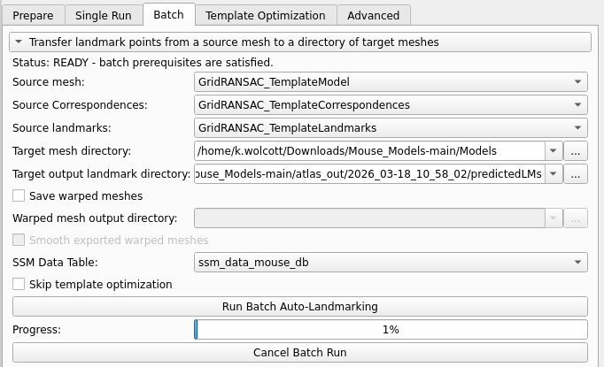

